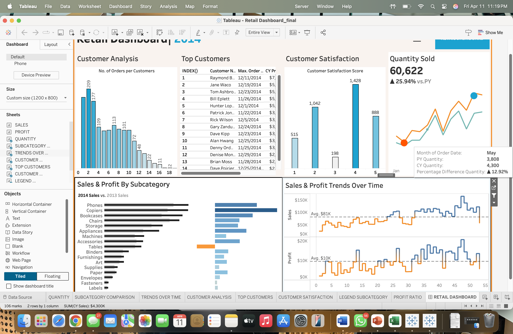

# Retail Sales Performance Dashboard 📊

## Overview
An interactive Tableau dashboard analyzing retail sales data (2011–2014) to uncover trends in sales, profits, customer satisfaction, and inventory performance.

## 🎯 Objective
Enable data-driven decision-making by visualizing:

- Sales & Profit trends
- Customer behavior & retention
- Subcategory performance
- Inventory movement
- Regional profitability

---

## 📸 Dashboard Preview

---

## 📊 Key KPIs

- Total Sales (YoY comparison)
- Total Profit (YoY comparison)
- Quantity Sold (+25.94% growth)
- Customer Satisfaction Score
- Top Customers by Profit
- Sales & Profit by Subcategory
- Weekly Trend Analysis
- Profit Ratio by State

---

## 🔍 Key Insights

- Phones & Chairs are top-performing categories
- Tables showed losses despite sales volume
- Customer satisfaction ratings increased 21%
- 60,622 units sold with 25.94% YoY growth
- Some states (Ohio, Colorado, Tennessee) show negative profit ratios

---

## 🛠 Tools Used

- Tableau
- Business Intelligence Analysis
- Data Visualization
- Trend Analysis

---

## 📁 Files Included

- Tableau Workbook (.twbx)
- Project Report (.docx)
- Presentation Slides (.pptx)

---

## 📌 Business Value

- Identifies high-performing products
- Detects regional profitability issues
- Supports strategic marketing decisions
- Improves inventory planning
